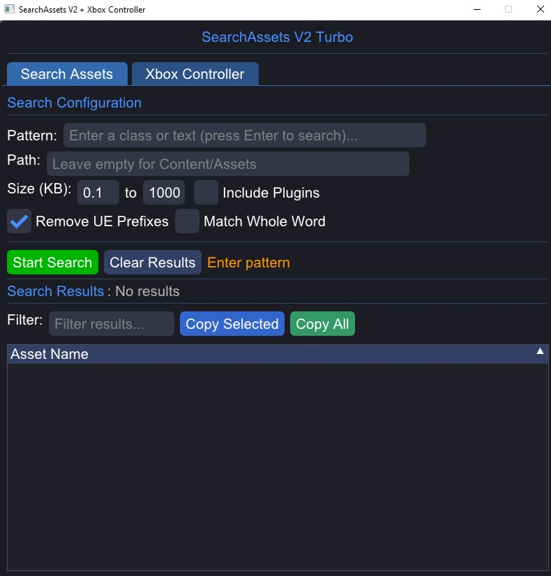
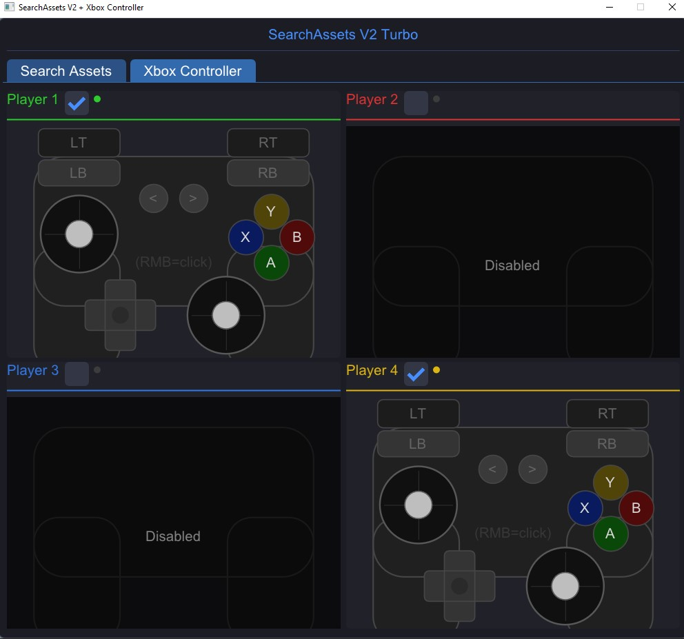

# SearchAssetsV2 Turbo with ImGui

GUI application for searching assets in Unreal Engine projects, with an integrated virtual Xbox 360 controller emulator. Built with ImGui and OpenGL.

> **Note:** This project was designed by me but entirely implemented with [Claude AI] under my supervision (i'm lazy).



---

## Features

### Search Assets tab
✅ **Modern GUI Interface** - ImGui-based responsive UI
✅ **Windowed Locked Mode** - Window auto-resizes per tab, cannot be manually resized
✅ **Real-time Search Results** - Live table updates during multithreaded search
✅ **Advanced Filtering** - Filter results as you type
✅ **Copy to Clipboard** - Individual or bulk copy operations
✅ **Unreal Prefix Removal** - Automatic A/U/F/S/T/E/I prefix handling
✅ **Plugin Search Support** - Search through plugin Content directories

### Xbox Controller tab
✅ **4 Virtual Xbox 360 Controllers** - Simultaneously connect up to 4 pads (in unreal you can use max 3 + keyboard)
✅ **Full Button/Axis Support** - Triggers, bumpers, sticks, ABXY, D-Pad, Back/Start
✅ **Per-player panels** - 2×2 grid layout, one panel per controller
✅ **Driver status banner** - Warning shown if ViGEmBus is not installed

---

## Xbox Controller tab — Requirements

The virtual controller feature relies on **ViGEmBus**, a Windows kernel-mode driver that exposes a virtual gamepad bus.

### Install ViGEmBus driver

Download and install the latest release from the official repository:

**[https://github.com/nefarius/ViGEmBus/releases](https://github.com/nefarius/ViGEmBus/releases)**

> **Windows 11 / Memory Integrity (HVCI):** Use **v1.22 or newer**, which is WHQL-signed and works with Memory Integrity enabled. Older unsigned versions will be blocked.

After installation, the virtual controllers appear in **Device Manager** under `Nefarius Virtual Gamepad Emulation Bus`.

---

## Build Requirements

- **CMake 3.20+**
- **C++20 compatible compiler** (MSVC 2022 recommended on Windows)
- **OpenGL 3.3+** support
- **Git** (for automatic dependency fetching via CMake FetchContent)
- **Windows only** for the Xbox Controller tab (ViGEmClient is Windows-specific)

## Building

### Windows (Visual Studio)

```bash
mkdir build && cd build
cmake .. -DCMAKE_BUILD_TYPE=Release
cmake --build . --config Release
```

All dependencies are downloaded automatically at configure time — no manual setup needed.

---

## Usage

### Search Assets
1. Launch `SearchAssetsImGui.exe`
2. Enter a class or asset name in the **Pattern** field
3. Click **Start Search** or press **F5**
4. Filter results in real time with the **Filter** box
5. Double-click or use **Copy Selected** / **Copy All** to copy to clipboard

### Xbox Controller
1. Switch to the **Xbox Controller** tab (window resizes automatically)
2. Make sure the **ViGEmBus** driver is installed (see above)
3. Click **Connect** on any panel to activate that virtual controller
4. Click buttons/triggers/sticks to send input — detectable by any game or DirectInput app

---

## Architecture

| File | Description |
|------|-------------|
| `SearchEngine.h/cpp` | Multithreaded asset search with regex, file size filtering, plugin support |
| `SearchAssetsGUI.h/cpp` | Main ImGui interface, tab bar, window resizing logic |
| `ControllerEmulator.h/cpp` | ViGEmClient C++ wrapper — manages up to 4 virtual Xbox 360 targets |
| `ControllerPanel.h/cpp` | ImGui widget for one controller — draws with `ImDrawList`, handles input |
| `main.cpp` | GLFW/OpenGL setup, main render loop |

---

## Dependencies (auto-downloaded via CMake FetchContent)

| Library | Version | Purpose | Link |
|---------|---------|---------|------|
| **GLFW** | 3.3.8 | Window management & OpenGL context | [glfw.org](https://www.glfw.org) |
| **Dear ImGui** | v1.90.1 | Immediate-mode GUI | [github.com/ocornut/imgui](https://github.com/ocornut/imgui) |
| **ViGEmClient** | master | C API for ViGEmBus virtual controllers | [github.com/nefarius/ViGEmClient](https://github.com/nefarius/ViGEmClient) |
| **OpenGL** | 3.3+ | Graphics rendering (system-provided) | — |

> **ViGEmBus driver** (separate install, not bundled): [github.com/nefarius/ViGEmBus](https://github.com/nefarius/ViGEmBus)

---

## Project Structure

```
SearchAssets ImGui/
├── src/
│   ├── SearchEngine.h/cpp        # Core multithreaded search logic
│   ├── SearchAssetsGUI.h/cpp     # ImGui interface + tab management
│   ├── ControllerEmulator.h/cpp  # ViGEmClient wrapper (virtual Xbox 360)
│   ├── ControllerPanel.h/cpp     # Per-controller ImGui widget
│   └── main.cpp                  # Application entry point
├── build/                        # Build output (git-ignored)
├── CMakeLists.txt                # Build configuration
└── README.md                     # This file
```
