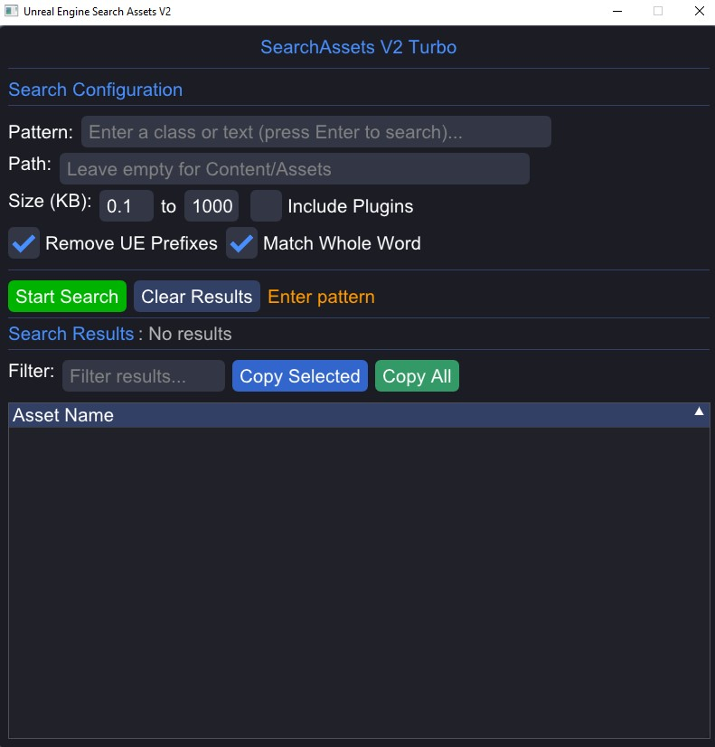

# SearchAssetsV2 Turbo with ImGui

GUI application for searching assets in Unreal Engine projects, built with ImGui and OpenGL.



## Features

✅ **Modern GUI Interface** - ImGui-based responsive UI  
✅ **Perfect Windows 11 Compatibility** - No terminal size conflicts  
✅ **Windowed Locked Mode** - Fixed size window, cannot be moved or resized  
✅ **Real-time Search Results** - Live table updates  
✅ **Advanced Filtering** - Filter results as you type  
✅ **Copy to Clipboard** - Individual or bulk copy operations  
✅ **Unreal Prefix Removal** - Automatic A/U/F/S/T/E/I prefix handling  
✅ **Plugin Search Support** - Search through plugin Content directories

## Build Requirements

- **CMake 3.20+**
- **C++20 compatible compiler**
- **OpenGL 3.3+** support
- **Git** (for dependency fetching)

## Building

### Windows (Visual Studio)

```bash
mkdir build && cd build
cmake .. -DCMAKE_BUILD_TYPE=Release
cmake --build . --config Release
```

## Usage

1. **Launch**: Run `SearchAssetsImGui.exe`
2. **Start Search**: Click "Start Search" or press F5
3. **Filter Results**: Type in the filter box to narrow results
4. **Copy Results**: Click items to select, then "Copy Selected"

## Architecture

- **SearchEngine.cpp/h**: Multithreaded search engine
- **SearchAssetsGUI.cpp/h**: ImGui interface implementation
- **main.cpp**: OpenGL/GLFW setup and main loop

## Dependencies (Auto-downloaded)

- **GLFW**: Window management
- **ImGui**: Immediate mode GUI
- **OpenGL**: Graphics rendering

## Project Structure

```
SearchAssets ImGui/
├── src/
│   ├── SearchEngine.h/cpp     # Core search logic
│   ├── SearchAssetsGUI.h/cpp  # ImGui interface
│   └── main.cpp               # Application entry point
├── build/                     # Build output
├── CMakeLists.txt            # Build configuration
└── README.md                 # This file
```
